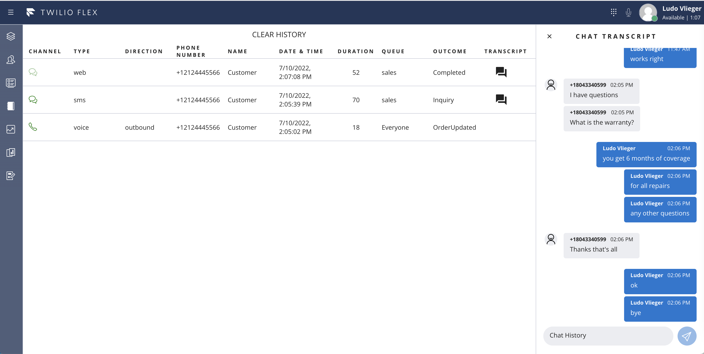
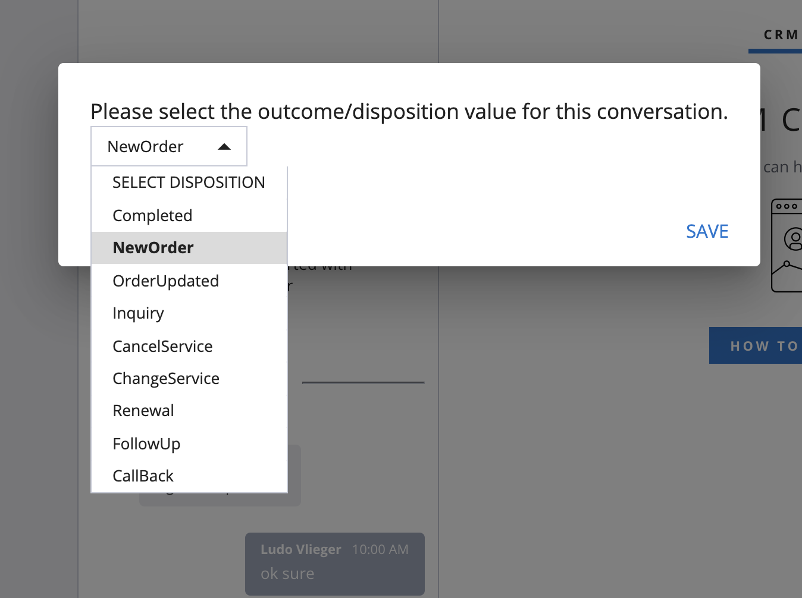
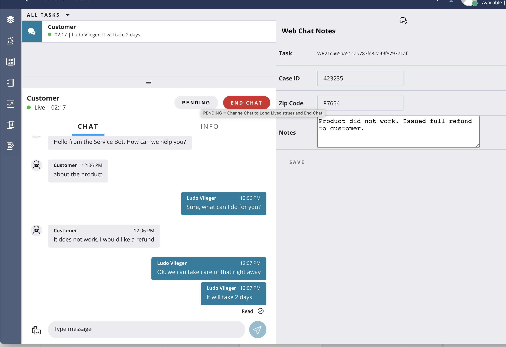

# Recent Contact History Flex Plugin

## Your custom Twilio Flex Plugin

Twilio Flex Plugins allow you to customize the appearance and behavior of [Twilio Flex](https://www.twilio.com/flex). If you want to learn more about the capabilities and how to use the API, check out our [Flex documentation](https://www.twilio.com/docs/flex).

## How it works
This Flex plugin adds a Recent Contacts View to the Flex UI and allows agents to make outbound calls (click-to-dial) back to the customers. The recent contacts list is stored in the Redux state (and persisted in localStorage browser cache). The Max Number of Contacts retained is configurable and agents can clear their contact history by clicking the Clear History button.  

Note: Upgrade to Flex UI 2.0 in progress.  Updated source for Flex UI 2.0 can found in -v2 folder.




This plugin also provides a modal Call Disposition window to agent after hangup (wrap up) to encourage agents to select the call outcome, before completing the call.  The outcome is saved in the task and displayed in the view.



NEW (July 2022): This plugin now also contains a form in the CRM Panel where the agent can to capture notes about the conversation, the customer's case number and Zip Code. Notes are stored in the task attributes and as Chat Channel Attributes.

Furthermore, Chat and SMS conversations can be changed to "Pending" which updates the chat channel attribute long_lived = true and adds the workerName to the channel attributes. (Flex 1.x only)



## Setup

Make sure you have [Node.js](https://nodejs.org) as well as [`npm`](https://npmjs.com). We support Node >= 10.12 (and recommend the _even_ versions of Node). Afterwards, install the dependencies by running `npm install`:

```bash
cd recent-contacts-plugin

# If you use npm
npm install
```

Next, please install the [Twilio CLI](https://www.twilio.com/docs/twilio-cli/quickstart) by running:

```bash
brew tap twilio/brew && brew install twilio
```
or
```bash
npm install twilio-cli -g
```

Finally, install the [Flex Plugin extension](https://github.com/twilio-labs/plugin-flex/tree/v1-beta) for the Twilio CLI:

```bash
twilio plugins:install @twilio-labs/plugin-flex@beta
```

## Development

Run `twilio flex:plugins --help` to see all the commands we currently support. For further details on Flex Plugins refer to our documentation on the [Twilio Docs](https://www.twilio.com/docs/flex/developer/plugins/cli) page.

